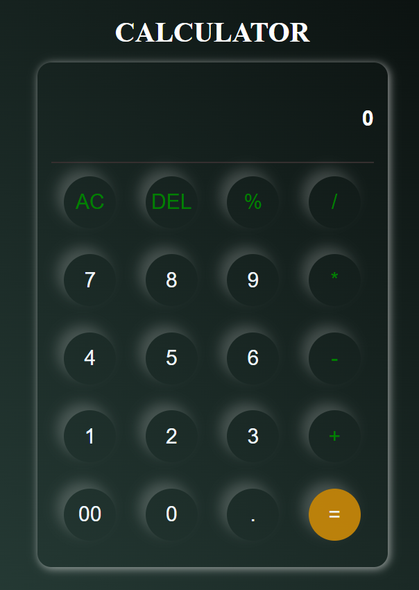

# 🔢 Simple Calculator Web App

Welcome to the **Simple Calculator** project — a sleek, modern calculator built using **HTML**, **CSS**, and **JavaScript**, designed and developed by **Adnan Shah**.

---

## 🚀 Features

- ✅ Clean and user-friendly interface
- 💡 Responsive design with modern **gradient background**
- ✨ Smooth button **hover effects**
- ➕ Basic arithmetic operations: `+`, `-`, `*`, `/`, `%`
- 🔄 **AC (All Clear)** and **DEL (Backspace)** functionalities
- 🟠 `=` button to evaluate expressions using `eval()`
- ⚠️ Handles invalid expressions and displays `"Error"`
- ✅ Prevents consecutive operators (e.g., `++`, `--`, `*/`)

💻 Tech Stack

HTML5

CSS3 (with custom styles and effects)

Vanilla JavaScript (event handling and evaluation logic)

🙌 Author

Made with ❤️ by Adnan Shah

GitHub: https://github.com/Adnan41663shah

LinkedIn: www.linkedin.com/in/adnan41663

📜 License
This project is open-source and free to use under the MIT License.

⭐ Show your support
If you like this project, don't forget to ⭐ the repo and share it with others!

